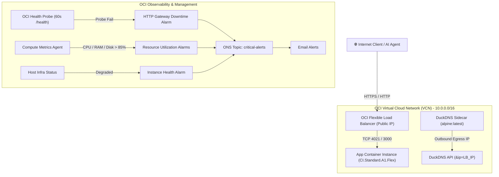

# OCI Serverless Container Infrastructure & CI/CD Migration Skill (`/oci-serverless`)

This skill provides the **battle-tested architectural blueprints, Terraform templates, gotchas, and GitHub Actions workflows** for migrating applications to Oracle Cloud Infrastructure (OCI) Always-Free Serverless Container Instances.

---

## 1. System Architecture Blueprint



---

## 2. Infrastructure & Terraform Guardrails (Always-Free Quotas)

### Shape Selection & Compute Quotas
* **Compute Shape**: Always use `CI.Standard.A1.Flex` (ARM64 Ampere Altra) for Always Free Tier quota compliance (up to 4 OCPUs & 24GB RAM).
* **Avoid AMD64 Flex Shapes**: `CI.Standard.E4.Flex` (AMD64) frequently rejects provisioning with `400 LimitExceeded` on standard free tier accounts.
* **Multi-Arch Docker Images**: Always build multi-arch Docker images (`platforms: linux/amd64,linux/arm64`) using `docker/setup-qemu-action@v3` and `docker/setup-buildx-action@v3` in GitHub Actions.

### DuckDNS Sidecar Egress IP Gotcha & Fix
> [!WARNING]
> **The Sidecar Egress IP Bug**:
> Sidecar containers running inside an OCI Container Instance make outbound HTTP requests through the container's dynamic egress IP (`157.151.x.x`), NOT the Load Balancer's static public IP. If you run a standard DuckDNS updater, it will point your hostname to the wrong egress IP!
>
> **The Fix**:
> Always pass the Load Balancer's public IP explicitly via `&ip=${oci_load_balancer_load_balancer.lb.ip_address_details[0].ip_address}` in the DuckDNS script!

#### Terraform DuckDNS Sidecar Snippet:
```hcl
container {
  display_name = "duckdns-updater"
  image_url    = "alpine:latest" # Native ARM64 support

  command = [
    "sh", "-c",
    "while true; do wget -qO- \"https://www.duckdns.org/update?domains=${var.duckdns_subdomain}&token=${var.duckdns_token}&ip=${oci_load_balancer_load_balancer.lb.ip_address_details[0].ip_address}\"; sleep 300; done"
  ]
}
```

### Security Lists & Load Balancer Backend Health Checks
> [!IMPORTANT]
> - Ensure the VCN Security List (`oci_core_security_list`) includes an ingress rule on the application port (e.g. TCP `4021` or `3000`) from `0.0.0.0/0` (or VCN CIDR `10.0.0.0/16`).
> - Automatically register the container instance private IP into the Load Balancer backend set using `oci_load_balancer_backend`.

---

## 3. OCI Monitoring, Probes & Alerting Setup (`terraform/monitoring.tf`)

Provision 5 critical alarms paired with an OCI Notification Topic (ONS) and HTTP Health Checks Probe:

```hcl
# 1. ONS Notification Topic
resource "oci_ons_notification_topic" "alerts" {
  compartment_id = var.compartment_ocid
  name           = "${var.app_name}-critical-alerts"
}

# 2. Email Subscription
resource "oci_ons_subscription" "email" {
  compartment_id = var.compartment_ocid
  topic_id       = oci_ons_notification_topic.alerts.id
  protocol       = "EMAIL"
  endpoint       = var.notification_email
}

# 3. HTTP Health Checks Probe (60s Probe to /health)
resource "oci_health_checks_http_monitor" "health_check" {
  compartment_id      = var.compartment_ocid
  display_name        = "${var.app_name}-http-check"
  targets             = ["${var.duckdns_subdomain}.duckdns.org"]
  protocol            = "HTTPS"
  port                = 443
  path                = "/api/v1/health"
  interval_in_seconds = 60
  timeout_in_seconds  = 10
  method              = "GET"
  is_enabled          = true
}

# 4. Alarms (CPU, Memory, Disk, Host Health, Downtime)
resource "oci_monitoring_alarm" "cpu_high" {
  compartment_id = var.compartment_ocid
  display_name   = "${var.app_name}-cpu-high"
  destinations   = [oci_ons_notification_topic.alerts.id]
  is_enabled     = true
  namespace      = "oci_containerinstances"
  query          = "CpuUtilization[1m]{resourceId = \"${oci_container_instances_container_instance.app.id}\"}.mean() > 85"
  severity       = "CRITICAL"
  pending_duration = "PT5M"
}

resource "oci_monitoring_alarm" "http_down" {
  compartment_id = var.compartment_ocid
  display_name   = "${var.app_name}-downtime"
  destinations   = [oci_ons_notification_topic.alerts.id]
  is_enabled     = true
  namespace      = "oci_healthchecks"
  query          = "http_status[1m]{monitorId = \"${oci_health_checks_http_monitor.health_check.id}\"}.mean() != 1"
  severity       = "CRITICAL"
  pending_duration = "PT2M"
}
```

---

## 4. GitHub Actions CI/CD Best Practices & Secret Authentication

### Required GitHub Repository Secrets (Workload Identity / OCIR / Application)

For OCI Container Registry (OCIR) and GitHub Actions automation, you only need the following minimal secret set:

| Secret Name | Required Value / Description | Example |
| :--- | :--- | :--- |
| `OCI_USER_OCID` | OCID of your OCI User | `ocid1.user.oc1..aaaaaaa...` |
| `OCI_TENANCY_OCID` | OCID of your OCI Tenancy | `ocid1.tenancy.oc1..aaaaaaa...` |
| `OCI_TENANCY_NAMESPACE` | Object Storage / OCIR Tenancy Namespace | `ax8z9x21` |
| `OCIR_USERNAME` | OCIR Login Username (`<namespace>/<username>`) | `ax8z9x21/oracle_user` |
| `OCIR_AUTH_TOKEN` | Generated OCI Auth Token for Registry Login | `aX9#kL2$mP8q...` |
| `OCIR_REGION_ENDPOINT` | OCI Registry Endpoint | `iad.ocir.io` (Ashburn) or `phx.ocir.io` |
| `DUCKDNS_SUBDOMAIN` | DuckDNS subdomain | `kya-service` |
| `DUCKDNS_TOKEN` | DuckDNS API token | `12345678-abcd...` |
| `SUPABASE_URL` | Supabase Project URL | `https://your-project.supabase.co` |
| `SUPABASE_KEY` | Supabase Service Role Key | `eyJhbGciOiJIUzI1NiIsInR5cCI6...` |

> [!TIP]
> **Minimal Secret Pattern**: If using OCI Native Workload Identity / API signing authentication or OCIR Token auth, you do NOT need to store static PEM keys or database password strings in GitHub if using secrets manager or dynamic instance principal delegation.

### Prevent Redundant Deployments (`paths-ignore`)
Add `paths-ignore` to `.github/workflows/deploy.yml` or `ci.yml` so non-backend changes (`sdks/**`, `docs/**`, `examples/**`, `**.md`) don't trigger unnecessary Docker container builds or OCI deployments:

```yaml
on:
  push:
    branches:
      - main
    paths-ignore:
      - 'sdks/**'
      - 'python-sdk/**'
      - '**.md'
      - 'docs/**'
  workflow_dispatch:
```

### Unified Package / SDK Publishing (`publish.yml`)
Consolidate SDK/package publishing into a single workflow with `workflow_dispatch` selection dropdown:

```yaml
name: Publish Client SDKs

on:
  release:
    types: [published]
  workflow_dispatch:
    inputs:
      target:
        description: 'Target SDK to publish (all, npm, pypi)'
        required: true
        default: 'all'
        type: choice
        options:
          - all
          - npm
          - pypi
```

### Test Isolation
Wrap external network initializations in application code with `if (process.env.NODE_ENV !== 'test')` to keep test suites 100% offline and prevent skewing production metrics.

---

## 5. Verification Checklist

1. **Local & CI Tests**: Run full test suites offline before deployment.
2. **Terraform Apply**: Run `terraform apply` and verify output IP addresses.
3. **Live Endpoint Probes**:
   - `GET /health` ➔ `200 OK`
   - `POST /api/v1/...` ➔ Expected API status code
4. **OCI Alarm Status**: Verify all 5 alarms appear in OCI Console under **Observability & Management** ➔ **Monitoring** ➔ **Alarm Status**.
