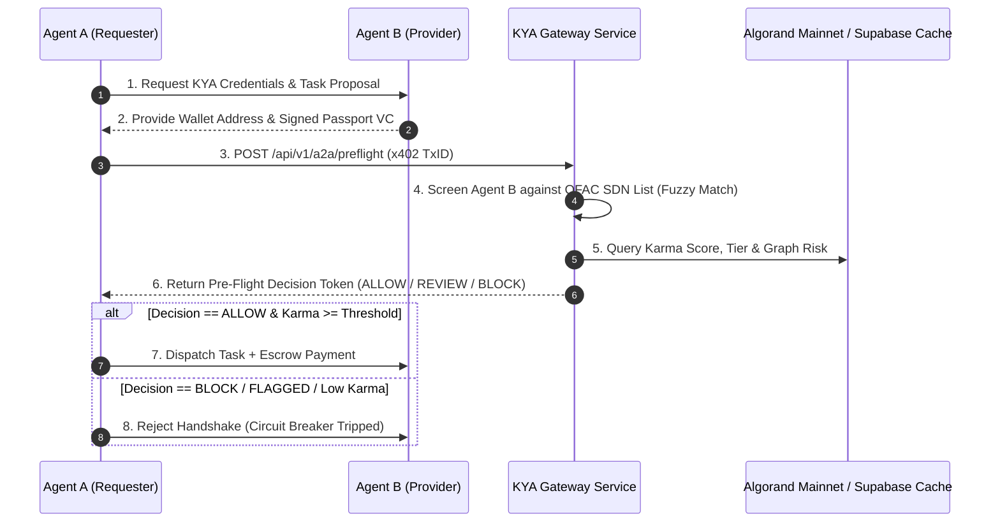

# KYA Service — End-State Architecture & Vision Specification

**Version:** 2.0.0  
**Status:** Approved  
**Last Updated:** 2026-08-08  

---

## Executive Summary

KYA (Know Your Agent) is a **standalone, mainnet-native trust and compliance oracle for autonomous AI agents on Algorand**. It converts compliance and reputation overhead into a revenue-generating micro-service by pairing **HTTP 402 (x402) micro-payments** with **Algorand Box Storage Karma ledgers**, **OFAC sanctions fuzzy screening**, and **privacy-preserving Zero-Knowledge (ZK) identity assertions**.

---

## 🏛️ Comprehensive Architecture Diagram

```
                                  ┌────────────────────────────────────────────────────────┐
                                  │            Autonomous AI Agent / Client (A2A)          │
                                  └───────────────────────────┬────────────────────────────┘
                                                              │
                                                      HTTP Request + x402
                                                              │
                                                              ▼
┌──────────────────────────────────────────────────────────────────────────────────────────────────────────────────────────┐
│                                                  KYA SERVICE GATEWAY                                                     │
├──────────────────────────────┬──────────────────────────────┬──────────────────────────────┬─────────────────────────────┤
│  1. x402 Payment Gate        │  2. Sanctions Screening      │  3. Identity & Proofs        │  4. On-Chain Karma Ledger   │
│  - MicroALGO / USDCa fees    - Multi-list OFAC/EU/UN        - ZK-KYC assertion             - Algorand Box Storage        │
│  - Atomic fee splits (60/25/15)- Fuzzy Jaro-Winkler >= 0.88 - Zero on-chain PII (GDPR)     - ARC-28 events & indexer     │
│  - Replay protection         - Graph proximity check        - W3C Verifiable Credentials   - EigenTrust & anti-sybil     │
└──────────────────────────────┴──────────────────────────────┴──────────────────────────────┴─────────────────────────────┘
                                                              │
                                                    Anchored State Logs
                                                              │
                                                              ▼
                                               ┌─────────────────────────────┐
                                               │ Algorand Mainnet Blockchain │
                                               └─────────────────────────────┘
```

---

## 📐 1. Dynamic x402 Micro-Payment Architecture (Principle II)

Every non-health endpoint requires microALGO or ASA payments (USDCa, Asset ID `31566704`).

### 1.1 Atomic Revenue Waterfall (Algorand Group Txn)
Payments are split atomically at the smart contract level:
- **60% Node Operators**: Offsets compute for OFAC fuzzy searching, indexer queries, and wallet graph analysis.
- **25% Staking Insurance Pool**: Yield distributed to KYA collateral stakers backing dispute resolution.
- **15% Protocol Treasury**: Directs capital to automated watchlist fetchers, legal/compliance maintenance, and developer grants.

### 1.2 Dynamic Pricing Equation
The API request price $P(e, a, \text{load})$ for agent $a$ on endpoint $e$ scales dynamically:

$$P(e, a, \text{load}) = P_{\text{base}}(e) \cdot \left[ 1.0 - 0.60 \cdot \left( \frac{\text{Karma}_a}{10000 + \text{Karma}_a} \right) \right] \cdot \gamma_{\text{risk}} \cdot e^{\kappa \cdot \max(0, \text{TPS} - \text{TPS}_{\text{target}})}$$

- **Karma Discount**: Up to a **60% fee discount** for high-karma agents ($K_a \gg 0$).
- **Risk Multiplier ($\gamma_{\text{risk}}$)**: Unverified or novel wallet graph nodes pay up to **3.5x base price**, creating an economic barrier against spam and Sybil attacks.

---

## 🔒 2. Algorand On-Chain Karma & Box Storage Spec (Principle III)

To scale reputation tracking to millions of agents while maintaining minimal Minimum Balance Requirements (MBR):

### 2.1 Packed Binary Box Layout: `k_{agent_address}` (77 Bytes Static Size)

```
 0                   1                   2                   3
 0 1 2 3 4 5 6 7 8 9 0 1 2 3 4 5 6 7 8 9 0 1 2 3 4 5 6 7 8 9 0 1
+-+-+-+-+-+-+-+-+-+-+-+-+-+-+-+-+-+-+-+-+-+-+-+-+-+-+-+-+-+-+-+-+
|                       karma_score (uint64)                    |
+-+-+-+-+-+-+-+-+-+-+-+-+-+-+-+-+-+-+-+-+-+-+-+-+-+-+-+-+-+-+-+-+
|                       stake_amount (uint64)                   |
+-+-+-+-+-+-+-+-+-+-+-+-+-+-+-+-+-+-+-+-+-+-+-+-+-+-+-+-+-+-+-+-+
|                   risk_flags (uint32)         | ver_level(u8) |
+-+-+-+-+-+-+-+-+-+-+-+-+-+-+-+-+-+-+-+-+-+-+-+-+-+-+-+-+-+-+-+-+
|                     registered_at (uint64)                    |
+-+-+-+-+-+-+-+-+-+-+-+-+-+-+-+-+-+-+-+-+-+-+-+-+-+-+-+-+-+-+-+-+
|                      last_updated (uint64)                    |
+-+-+-+-+-+-+-+-+-+-+-+-+-+-+-+-+-+-+-+-+-+-+-+-+-+-+-+-+-+-+-+-+
|                                                               |
+                    owner_identity_hash                        +
|                        (bytes32)                              |
+                                                               +
|                                                               |
+-+-+-+-+-+-+-+-+-+-+-+-+-+-+-+-+-+-+-+-+-+-+-+-+-+-+-+-+-+-+-+-+
|                   total_queries_paid (uint64)                 |
+-+-+-+-+-+-+-+-+-+-+-+-+-+-+-+-+-+-+-+-+-+-+-+-+-+-+-+-+-+-+-+-+
```

### 2.2 MBR Cost & Refundability
- Box Key (34B) + Box Value (77B) = 111 Total Bytes.
- **MBR Cost**: $2,500 + 400 \times 111 = \mathbf{46,900 \text{ microALGO}} \quad (0.0469 \text{ ALGO})$.
- **Refund Policy**: Upon deregistration (`box_del`), the entire **0.0469 ALGO MBR is refunded** back to the agent wallet.

### 2.3 ARC-28 Event Standard Selectors
Events are emitted on-chain for Conduit ingestion into Supabase read-caches:
- `AgentRegistered(address,byte[32],uint64)` $\rightarrow$ `0x4a7e9b12`
- `KarmaUpdated(address,uint64,uint32,uint16,uint64)` $\rightarrow$ `0x8c21f904`
- `RiskFlagged(address,uint32,uint64)` $\rightarrow$ `0x1f94d03e`
- `X402PaymentSettled(address,byte[16],uint64,uint64,uint64)` $\rightarrow$ `0x3d6a89c1`

---

## ⚡ 3. Mechanism Design: Anti-Sybil, Staking & Slashing

1. **Seed-Anchored Personalized EigenTrust (PPR)**:
   Trust vectors $e_S$ are anchored exclusively to KYC-verified seed nodes ($S_0$). Unverified Sybil clusters cannot wash-trade or farm Karma outside the trusted seed graph:
   $$t^{(k+1)} = (1 - d) \cdot e_S + d \cdot P^T t^{(k)} \quad (d = 0.85)$$
2. **Quadratic Bonding Escrow**:
   High-influence agents must stake ALGO / KYA tokens into an Algorand Box Storage escrow:
   $$\text{Bond}(a) = \beta \cdot (\text{Karma}_a)^2 + \alpha$$
3. **Temporal Inactivity Half-Life**:
   Karma decays exponentially over inactive periods with a **90-day half-life**:
   $$\text{Karma}(t) = \text{Karma}_0 \cdot e^{-\lambda t} \quad \text{where } \lambda = \frac{\ln(2)}{90 \text{ days}}$$
4. **Slashing Matrix**:
   - **Tier 1 (Minor SLA defect)**: 2% bond slash, -5% Karma.
   - **Tier 2 (Moderate defect/fraud)**: 15% bond slash, -25% Karma.
   - **Tier 3 (Sanctions/Malicious)**: 100% bond burn/treasury, permanent blacklisting ($-\infty$ Karma).

---

## 🤝 4. A2A Protocol, Verifiable Credentials & Agent Framework SDKs (Principle IV)



### 4.1 Framework Middleware Integrations
SDK interceptor modules auto-sign x402 payments and enforce Karma thresholds across major agent runtimes:
- **ElizaOS**: `@elizaos/plugin-kya` (`KYA_PREFLIGHT_EVALUATOR`)
- **OpenClaw**: `openclaw-kya-middleware` (Subagent delegation filter on OpenClaw daemon / DGX Spark)
- **LangChain**: `langchain-kya` (`KYAPreflightTool`)
- **AutoGen**: `autogen-kya-filter` (`ConversableAgent` message filter)

### 4.2 Circuit-Breaker State Machine
- **CLOSED (Normal)**: Full execution rights, standard escrow.
- **HALF-OPEN (Probation)**: Karma 500–650 or screening `FLAGGED` (confidence 0.50–0.84). Micro-task limits enforced (max 50 ALGO), 200% collateral required.
- **OPEN (Hard Block)**: Sanctions screening `FAIL` (confidence $\ge 0.85$) or Karma $< 500$. Immediate task cancellation, funds returned, incident logged to Merkle audit log.

---

## ⚖️ 5. Legal Compliance & Zero-Knowledge Privacy (Principle VI & VII)

1. **Zero On-Chain PII (GDPR Art. 17 Compliance)**:
   Storing raw PII or un-salted hashes on an immutable ledger violates GDPR. KYA uses **off-chain hardware-attested enclave verification** (purged within 72 hours) and on-chain **Groth16 zk-SNARK proof verification**.
2. **Multi-List Fuzzy Screening Engine**:
   OFAC SDN, EU CFSP, UN Security Council, and UK HMT. Combines **Jaro-Winkler ($\ge 0.88$)**, Levenshtein distance, and Double Metaphone phonetic matching.
3. **Cryptographic Compliance Logging**:
   Screening responses emit a verifiable Merkle Audit proof header (`X-KYA-Audit-Proof`). Periodic Merkle roots are anchored onto Algorand transaction notes for tamper-proof regulatory reporting (BSA / EU AI Act Art. 12).
4. **Micro-Payment Legal Characterization**:
   Direct seller of computational API bandwidth. Exempt from FinCEN Money Transmitter Licensing under **31 CFR § 1010.100(ff)(5)** and **FIN-2019-G001**.

---

## 🧠 6. Trust Psychology & Visual Hierarchy

### Master Trust Formula ($S_{\text{KYA}} \in [0, 1000]$)

$$S_{\text{KYA}}(a, t) = \text{Clamp}_{0}^{1000} \left[ \left( 0.35 \cdot S_{\text{Tx}} + 0.25 \cdot S_{\text{Ident}} + 0.20 \cdot S_{\text{Endorse}} + 0.20 \cdot S_{\text{Staked}} \right) \times M_{\text{Sanction}} \right]$$

### Scoring Tiers & Human Visual Badging

| Tier | Score Range | Badge Name | Human Action Required | Capped Execution Limit |
| :--- | :--- | :--- | :--- | :--- |
| **Tier 0** | $0 - 299$ | Unverified / High Risk | **MANUAL APPROVAL REQUIRED** | 0 ALGO (Block) |
| **Tier 1** | $300 - 599$ | Screened Agent | **AUTOMATED WITH CAP** | $\le 50$ ALGO |
| **Tier 2** | $600 - 849$ | Verified Mainnet Agent | **AUTONOMOUS EXECUTION** | $\le 5,000$ ALGO |
| **Tier 3** | $850 - 1000$ | Sovereign Enterprise | **VIP UNRESTRICTED** | Unlimited |
